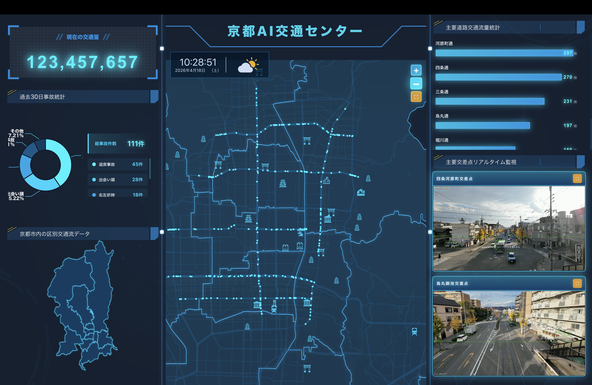
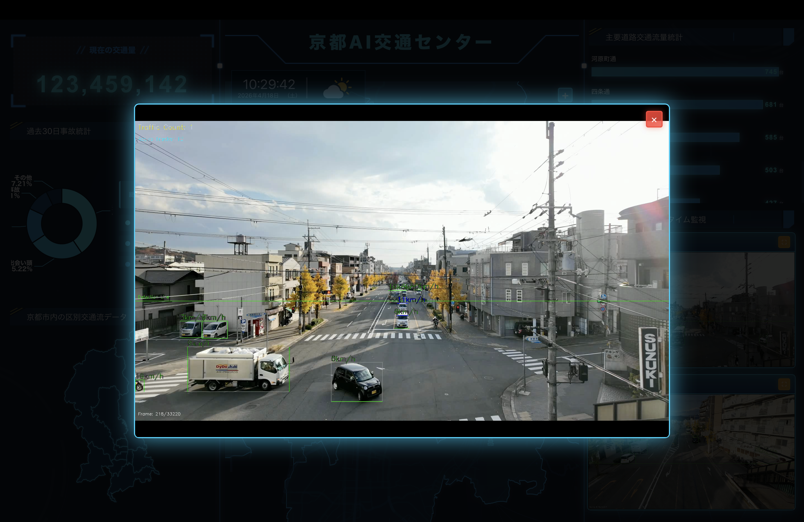
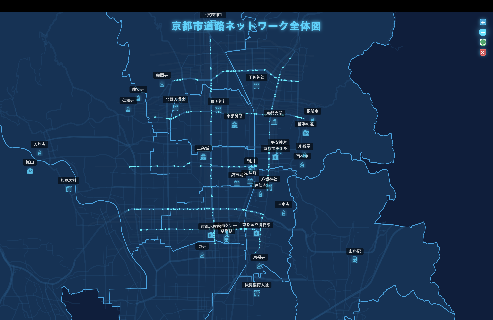

# AI-driven Pseudo Real-Time Traffic Monitoring System

## 1. Project Overview

This work presents a **pseudo real-time traffic monitoring system** that couples **offline computer vision inference** (vehicle detection and multi-object tracking) with a **time-series reconstruction** of traffic states. The inferred trajectories and aggregate statistics are exported as structured **JSON time-series**, which are subsequently **replayed** in an interactive dashboard to emulate continuous monitoring under controlled computational budgets.

The central claim is methodological: **inference and interactive visualization are decoupled**, enabling resource-efficient analysis and human-facing inspection without requiring sustained on-line model serving at full video frame rates.

---

## 2. Motivation

Large-scale traffic surveillance increasingly relies on dense sensing and heavy compute for **true real-time** analytics. In practice, many research and deployment settings face **strict resource constraints** (edge compute limits, batch experimentation, reproducible ablations, and human evaluation protocols). Continuous on-line inference can dominate cost and complicate controlled comparisons across models and tracking policies.

This project explores an alternative operating point: **perform detection and tracking offline (or in batch)**, materialize traffic state as **time-indexed data**, and provide **interactive pseudo real-time playback** in a visualization layer. The objective is not to replace real-time systems in all settings, but to **study when decoupled pipelines are sufficient** for monitoring tasks that prioritize interpretability, auditing, and scenario-based what-if inspection.

---

## 3. Key Contributions

- **Decoupled architecture for resource-aware monitoring.** We propose separating (i) CV inference and trajectory analytics from (ii) interactive visualization, making compute usage predictable and enabling reproducible experimentation.
- **Traffic state as time-series data.** The system demonstrates how detection and tracking outputs can be transformed into **structured temporal signals** (counts, segment-level statistics, and event-like updates) suitable for downstream visualization and analysis.
- **Multi-level interactive visualization.** The dashboard supports **city / road / intersection** navigation semantics, aligning human inspection workflows with spatial aggregation levels common in intelligent transportation systems (ITS) research.
- **HCI-relevant interaction model.** From a human-centered AI perspective, the interface emphasizes **inspectability**: users can navigate spatial contexts and temporal replay without requiring access to raw video streams at interaction time.

---

## 4. System Architecture

At a high level, the system comprises three layers:

1. **Perception and association (offline / batch).** Video is processed to produce detections and track identities across frames.
2. **Traffic analytics and serialization.** Track-level outputs are aggregated into traffic measurements and exported as **JSON time-series** aligned to a common clock and spatial indexing scheme.
3. **Interactive visualization and replay.** A web-based dashboard loads the serialized data and renders **pseudo real-time** updates, including map-centric context and chart-based summaries.

This architecture intentionally mirrors a **publish-subscribe** separation: the CV pipeline publishes state trajectories; the visualization subscribes to replayable streams.

### 4.1 Data flow (end-to-end pipeline)

The end-to-end flow is:

**video ? detection ? tracking ? traffic analysis ? JSON time-series ? interactive dashboard**

- **Video input:** raw or preprocessed sequences used for offline inference.
- **Detection:** frame-wise object hypotheses for vehicles (class-aware as supported by the detector).
- **Tracking:** multi-object association across time to stabilize identities and support counting and segment statistics.
- **Analysis:** derivation of traffic measurements (for example counts, occupancy proxies, segment-level summaries; exact definitions depend on configuration and road geometry).
- **JSON generation:** compact, replay-friendly representations for temporal scrubbing and multi-scale visualization.
- **Visualization:** interactive replay and spatial navigation (city / road / intersection) with charting and map overlays.

This pipeline clarifies **where latency budgets apply**: model inference is amortized offline, while interaction-time costs are dominated by rendering and data handling.

---

## 5. AI / CV Pipeline (Detection, Tracking, Analysis)

- **YOLO-based detection:** we use a modern YOLO-family detector to obtain vehicle hypotheses per frame, trading off accuracy and throughput according to model scale and deployment constraints.
- **Multi-object tracking:** detections are linked temporally to form tracks; this step is critical for stable counting and for reducing flicker in downstream analytics.
- **Traffic flow analysis:** track streams are aggregated into statistics aligned to spatial units (for example road segments or intersection neighborhoods) and temporal bins.
- **Serialization:** outputs are written as JSON time-series to support deterministic replay and external tooling.

---

## 6. Visualization and Interaction (HCI Perspective)

From an HCI standpoint, the dashboard is designed to support **situated interpretation**: users relate quantitative signals to geographic context through **map-linked views** and **temporal controls** (playback and scrubbing). The interaction model emphasizes:

- **Progressive disclosure** across spatial scales (city ? road ? intersection).
- **Inspectable summaries** via charts (ECharts) rather than opaque end-to-end predictions alone.
- **Replay as a proxy for monitoring**, enabling lab-scale evaluation and advisor or reviewer walkthroughs without continuous streaming inference.

This framing positions the interface not merely as a UI, but as an **interpretability instrument** for spatiotemporal traffic phenomena derived from CV outputs.

---

## 7. Tech Stack

- **Offline CV / analytics (conceptual pipeline):** Python, OpenCV, YOLO-family detectors, multi-object tracking, and JSON export tooling.
- **Interactive dashboard (this repository):** React, TypeScript, Vite, **Leaflet** for map-centered geospatial visualization, **ECharts** for time-series and statistical charts, Tailwind CSS for layout.

*Note:* Mapbox GL JS and related vector-tile stacks are common alternatives for deployment-scale mapping; this prototype emphasizes a lightweight web mapping stack while preserving the same **JSON contract** between analytics and visualization.

---

## 8. Project Structure (Representative)

```text
.
??? index.html
??? package.json
??? vite.config.ts
??? tsconfig.json
??? src/
?   ??? main.tsx
?   ??? App.tsx
?   ??? components/          # Map and reusable UI components
?   ??? pages/               # Dashboard and related views
?   ??? data/                # Static JSON / regional datasets for visualization
?   ??? assets/              # GeoJSON, icons, images, legacy JS/CSS assets
?   ??? styles/
?   ??? types/
??? ...
```

Large demonstration videos and bulky media artifacts are typically excluded from version control; place them locally or distribute via release assets as needed.

---

## 9. How to Run

### 9.1 Interactive dashboard (this repository)

```bash
npm install
npm run dev
```

Then open the local development URL printed by Vite (commonly `http://localhost:5173`).

```bash
npm run build
npm run preview
```

Use `build` / `preview` for a production-like bundle evaluation.

### 9.2 Offline CV pipeline (companion tooling)

The offline inference stack is implemented in Python and is organized around **OpenCV I/O**, **YOLO inference**, **tracking**, and **JSON export**. Exact entry points depend on your experimental configuration; the integration contract is: **produce JSON time-series consumable by the dashboard's data loaders**.

---

## 10. Research Positioning (VERY IMPORTANT)

This project is best understood as a **research prototype** at the intersection of **computer vision**, **intelligent transportation systems**, and **human-centered visualization**:

- **CV contribution (systems angle):** it studies how far one can push **offline** perception pipelines while still supporting **monitoring-like** workflows through replayable state.
- **ITS contribution:** it frames traffic understanding as **measurable, time-indexed signals** that can be audited and compared across models and tracking choices.
- **HCI contribution:** it foregrounds **interaction design** for interpretability: how analysts navigate spatial scales and temporal evolution when the underlying sensing is decoupled from the interface.

We position the work not as a claim of universal real-time deployment, but as an **exploration of efficiencyùfidelity trade-offs** in resource-constrained monitoring scenarios: an increasingly relevant question for sustainable sensing and reproducible research infrastructure.

---

## 11. Limitations

- **Pseudo real-time vs true real-time:** replayed monitoring does not guarantee the same latency properties as on-line closed-loop systems; findings are about **human-facing inspection** and **batch analytics**, not millisecond control loops.
- **Dependence on detection/tracking quality:** downstream statistics inherit detector errors, ID switches, and occlusion effects; uncertainty quantification is not the primary focus of this prototype.
- **Geospatial modeling scope:** road semantics and aggregation units simplify real-world topology; calibration to a specific city's sensor layout may be required for deployment-grade claims.
- **Generalization:** performance varies with camera viewpoint, weather, and domain shift; the system should be evaluated under dataset-specific protocols.

---

## 12. Future Work

- **Generative simulation and counterfactuals:** coupling reconstructed traffic states with generative models to synthesize perturbed scenarios (demand changes, incident injections) for controlled evaluation.
- **Interactive design studies:** user studies with domain experts to quantify how multi-scale map+chart interfaces affect task performance and trust calibration.
- **Tighter coupling of uncertainty:** propagating detection/tracking confidence into visualization semantics (for example reliability-aware overlays).
- **Scalable mapping stacks:** migrating to vector-tile pipelines (for example Mapbox GLùclass renderers) for larger geographies while preserving the same analytic JSON interfaces.

---

## 13. Demo (Placeholders)

Screenshots for this repository live under `src/assets/`:







---

## License

See `LICENSE` in the repository root (if provided).
